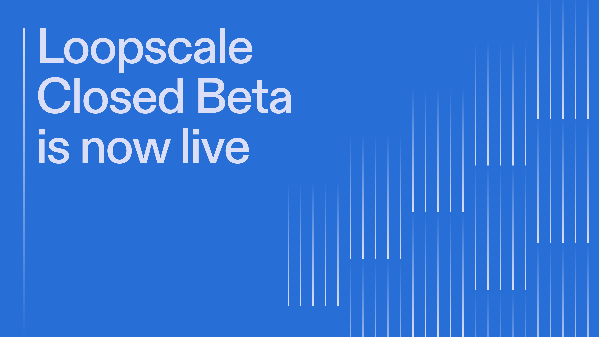

Loopscale is blockchain infrastructure that brings efficiency and flexibility to asset-based capital markets. It enables the compatibility of complex and long-tail collateral as well as configurability of loan structure. The Loopscale platform facilitates borrowing transactions ranging from DePIN participants financing hardware purchases with network tokens, whiskey traders leveraging existing inventory for purchase orders, and early employees at protocols seeking liquidity on locked assets.
‍
## Introducing Loopscale
Today, we’re opening the Closed Beta for our new permissionless product, Loopscale, a DeFi-familiar user experience, powered by these primitives and made compatible with RWAs and future tokenized assets.
‍
We’ve layered a new primitive, the Loopscale Creditbook, to generate virtual orderbooks across sets of standardized terms such as collateral, liquidation ratios, oracles, maturities, and fees. By abstracting order parameters and allowing differentiation only by APR, these standardizations concentrate protocol liquidity for efficient matching.
‍
## How it works
Lenders create offers by defining eligible collateral, APR, and durations. Offers are virtualized to a set of orders across matching orderbooks to be filled by borrowers to access the best market rates. Upon repayment, the principal is returned to the creditbook until the lender withdraws funds.
‍
Lenders can customize default handling, choosing between collateral repossession or principal receipt via third-party liquidation. Loans default if the loan is not repaid by the maturity date or the ratio of collateral to the debt value reaches the liquidation ratio.
‍
## Why Loopscale?
Loopscale is a new paradigm in on-chain finance that introduces:
1. **Robust collateral support**: Bring a variety of tokenized assets to Loopscale to build off of them. Allow lenders to set specific terms for collateral types, preserving liquidity while minimizing the risk surface area of liquidation.
2. **Bilateral loan matching**: Improving market efficiency and risk control for lenders and reducing the cost of capital for borrowers
3. **Virtualized lending orderbooks**: Concentrating liquidity for bilateral loans across standardized terms while preserving long-term flexibility
   Fixed-rate, fixed-term borrowing: Enabling execution of specific investment strategies over longer time horizons
4. **Segregated collateral management**: Reducing risk and eliminating potential liquidity mismatches with non-rehypothecated collateral
   ‍
### Robust collateral support

The absence of collateral segregation in many lending platforms also limits the diversity of eligible collateral. Some protocols have attempted to address this issue by creating restricted pools, but this ultimately leads to capital fragmentation and higher borrowing costs for all markets.
‍
With Loopscale, lenders may set specific terms for each collateral type, concentrating liquidity by tailoring terms on a per-collateral basis. Each loan is isolated, minimizing the disruption and risk of liquidations compared to platforms that pool risk across all assets. This leads to the ability to support a broad base of crypto native collateral as well as RWAs and security tokens.
‍
### Bilateral loan matching

Current DeFi lending applications determine borrowing rates using a curve and distribute the yield across a broad lender base. This approach prioritizes liquidity and ease-of-use for lenders at the expense of interest rates for borrowers. While there may always be a market for lenders willing to accept lower rates in exchange for simplicity, this design reduces market efficiency for lenders with risk preferences who are prepared to actively manage capital, leading to an increased cost of capital for borrowers.
‍
### Virtualized lending orderbooks

While there have been lending protocols supporting bilateral loans, many have failed to reach critical mass due to the fragmentation of liquidity inherent to one-to-one relationships. At launch, Loopscale abstracts the parameterization of loans, concentrating liquidity for bilateral loans across a series of standardized terms. Over time, more orderbooks will be introduced across more granular parameters. This approach enables short-term liquidity growth while preserving long-term flexibility.
‍
### Fixed-rate, fixed-term

On-chain lending products often experience fluctuating rates due to sudden changes in demand, making them unsuitable for executing specific investment strategies. Bilateral loans, lending orderbooks, and automated matching broaden the surface area for loan terms without introducing additional complexity.
‍
### Segregated collateral management

Most lending platforms in DeFi today are built on the early money market structures pioneered by platforms like Aave and Compound. These models pool risk across all assets, making it more challenging to accurately price the risk associated with individual collateral assets. This approach has led to some of the most significant exploits in DeFi and results in substantial inefficiencies in pricing, as lenders must account for the risk of a diverse collateral base uniformly. An issue with one asset can have cascading effects across all assets, driving up the cost of borrowing against less volatile assets.
‍
Loopscale employs a novel approach by ensuring that no collateral is rehypothecated, meaning assets are not lent out while being used as collateral. This strategy not only reduces risk but also eliminates the potential for liquidity mismatches involving expected collateral in emergency situations.
‍
## Closed Beta
As part of the launch of our Closed Beta, anyone can create an account, joining the waitlist to access platform functionality. With a Closed Beta access code, users can borrow and lend on Loopscale. You can find access codes in our Discord server. After joining the Closed Beta, you will be invited to join the Loopscale Closed Beta Telegram group
‍
### What should I try?

We invite you to create an account and explore the platform. Here are some features you can try:
1. View markets and explore the Creditbook
2. Discover new collateral options
3. Start a loan by borrowing funds
4. Check out your portfolio
   ‍
   For a more detailed guide on using the platform, please refer to our product documentation.
   ‍
### How else can I get involved?

We encourage you to join our Discord community and follow us on Twitter to stay up-to-date with the latest news and developments. Message us for a Closed Beta access code, and waitlisted users can still refer other users to boost their position on the waitlist and earn points.k tokens, whiskey traders leveraging existing inventory for purchase orders, and early employees at protocols seeking liquidity on locked assets.
‍
## Introducing Loopscale
Today, we’re opening the Closed Beta for our new permissionless product, Loopscale, a DeFi-familiar user experience, powered by these primitives and made compatible with RWAs and future tokenized assets.
‍
We’ve layered a new primitive, the Loopscale Creditbook, to generate virtual orderbooks across sets of standardized terms such as collateral, liquidation ratios, oracles, maturities, and fees. By abstracting order parameters and allowing differentiation only by APR, these standardizations concentrate protocol liquidity for efficient matching.
‍
## How it works
Lenders create offers by defining eligible collateral, APR, and durations. Offers are virtualized to a set of orders across matching orderbooks to be filled by borrowers to access the best market rates. Upon repayment, the principal is returned to the creditbook until the lender withdraws funds.
‍
Lenders can customize default handling, choosing between collateral repossession or principal receipt via third-party liquidation. Loans default if the loan is not repaid by the maturity date or the ratio of collateral to the debt value reaches the liquidation ratio.
‍
## Why Loopscale?
Loopscale is a new paradigm in on-chain finance that introduces:
1. **Robust collateral support**: Bring a variety of tokenized assets to Loopscale to build off of them. Allow lenders to set specific terms for collateral types, preserving liquidity while minimizing the risk surface area of liquidation.
2. **Bilateral loan matching**: Improving market efficiency and risk control for lenders and reducing the cost of capital for borrowers
3. **Virtualized lending orderbooks**: Concentrating liquidity for bilateral loans across standardized terms while preserving long-term flexibility
Fixed-rate, fixed-term borrowing: Enabling execution of specific investment strategies over longer time horizons
4. **Segregated collateral management**: Reducing risk and eliminating potential liquidity mismatches with non-rehypothecated collateral
‍
### Robust collateral support

The absence of collateral segregation in many lending platforms also limits the diversity of eligible collateral. Some protocols have attempted to address this issue by creating restricted pools, but this ultimately leads to capital fragmentation and higher borrowing costs for all markets.
‍
With Loopscale, lenders may set specific terms for each collateral type, concentrating liquidity by tailoring terms on a per-collateral basis. Each loan is isolated, minimizing the disruption and risk of liquidations compared to platforms that pool risk across all assets. This leads to the ability to support a broad base of crypto native collateral as well as RWAs and security tokens.
‍
### Bilateral loan matching

Current DeFi lending applications determine borrowing rates using a curve and distribute the yield across a broad lender base. This approach prioritizes liquidity and ease-of-use for lenders at the expense of interest rates for borrowers. While there may always be a market for lenders willing to accept lower rates in exchange for simplicity, this design reduces market efficiency for lenders with risk preferences who are prepared to actively manage capital, leading to an increased cost of capital for borrowers.
‍
### Virtualized lending orderbooks

While there have been lending protocols supporting bilateral loans, many have failed to reach critical mass due to the fragmentation of liquidity inherent to one-to-one relationships. At launch, Loopscale abstracts the parameterization of loans, concentrating liquidity for bilateral loans across a series of standardized terms. Over time, more orderbooks will be introduced across more granular parameters. This approach enables short-term liquidity growth while preserving long-term flexibility.
‍
### Fixed-rate, fixed-term

On-chain lending products often experience fluctuating rates due to sudden changes in demand, making them unsuitable for executing specific investment strategies. Bilateral loans, lending orderbooks, and automated matching broaden the surface area for loan terms without introducing additional complexity.
‍
### Segregated collateral management

Most lending platforms in DeFi today are built on the early money market structures pioneered by platforms like Aave and Compound. These models pool risk across all assets, making it more challenging to accurately price the risk associated with individual collateral assets. This approach has led to some of the most significant exploits in DeFi and results in substantial inefficiencies in pricing, as lenders must account for the risk of a diverse collateral base uniformly. An issue with one asset can have cascading effects across all assets, driving up the cost of borrowing against less volatile assets.
‍
Loopscale employs a novel approach by ensuring that no collateral is rehypothecated, meaning assets are not lent out while being used as collateral. This strategy not only reduces risk but also eliminates the potential for liquidity mismatches involving expected collateral in emergency situations.
‍
## Closed Beta
As part of the launch of our Closed Beta, anyone can create an account, joining the waitlist to access platform functionality. With a Closed Beta access code, users can borrow and lend on Loopscale. You can find access codes in our Discord server. After joining the Closed Beta, you will be invited to join the Loopscale Closed Beta Telegram group
‍
### What should I try?

We invite you to create an account and explore the platform. Here are some features you can try:
1. View markets and explore the Creditbook
2. Discover new collateral options
3. Start a loan by borrowing funds
4. Check out your portfolio
‍
For a more detailed guide on using the platform, please refer to our product documentation.
‍
### How else can I get involved?

We encourage you to join our Discord community and follow us on Twitter to stay up-to-date with the latest news and developments. Message us for a Closed Beta access code, and waitlisted users can still refer other users to boost their position on the waitlist and earn points.